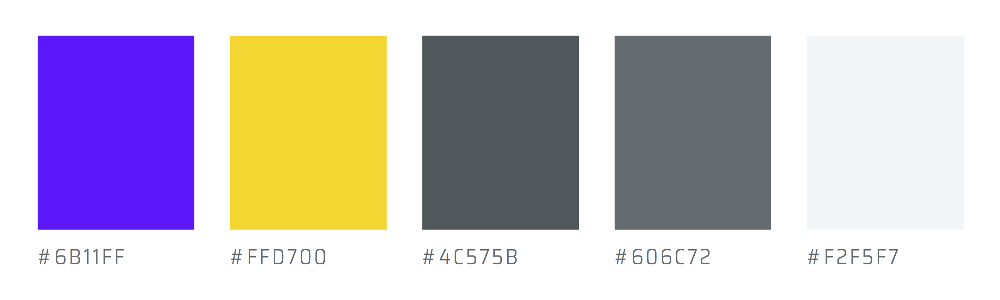
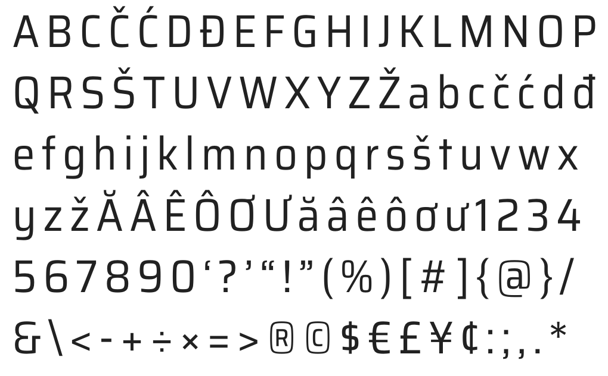

## Color Palette

Color Name    | Hex Triplet
------------- | -----------
Blue          | `#6B11FF`
Yellow        | `#FFD700`
Dark Gray     | `#4C575B`
Gray          | `#606C72`
Light Gray†   | `#E5E8EA`
Lightest Gray | `#F2F5F7`

† *Not depicted in image*

## Typeface

Nashville PHP uses the [Saira font family][saira] from Omnibus-Type. Saira is
used in accordance with the [SIL Open Font License, 1.1][ofl].

## Acknowledgments

Nashville PHP extends a very special thanks to [CakeDC][] for their continued
support of our user group. CakeDC makes Nashville PHP possible through their
generous contributions.

We'd also like to thank [Henrique Ibaldo][ibaldo] for lending his design and
branding expertise. We love our new brand elements, and it's all thanks to
Henrique. Give him a shout-out on [Twitter][twitter-ibaldo],
[Instagram][instagram-hibaldo], or [Dribbble][dribbble-ibaldo], and thank him
for his work.

 
[][cakedc]

[saira]: https://github.com/Omnibus-Type/Saira
[ofl]: https://github.com/Omnibus-Type/Saira/blob/master/OFL.txt
[cakedc]: https://www.cakedc.com/
[ibaldo]: https://ibaldo.co/
[twitter-ibaldo]: https://twitter.com/ibaldo
[instagram-hibaldo]: https://www.instagram.com/hibaldo/
[dribbble-ibaldo]: https://dribbble.com/ibaldo
